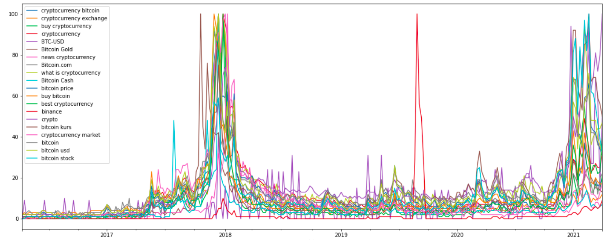
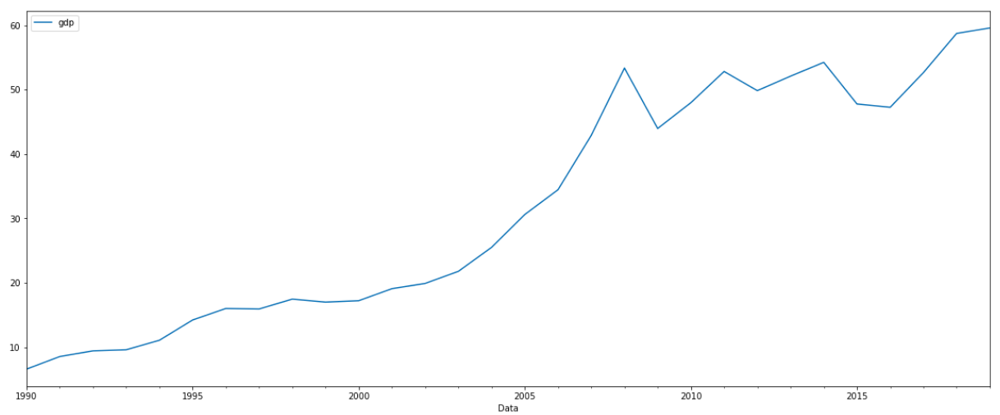

# Diploms programs

## 1. [Bitcoin predicton](bitcoin%20predicton)

Predict 1 day stock value of Bitcoin. I used Yahoo API for gathering stock value and Google Trends API. Using RandomForest, XGBoost, LinearRegression, Extra Trees, Decision Tree, Elastic Net models.

## 2. [Countries GDP and stock prediction](gdp%20and%20stock%20predicton)
Predict GDP of Ukraine and Poland. Predict stock values of Netflix and Facebook. Using Decision Tree, Linear Regression, KNN and BayesianRidge Regression models.

