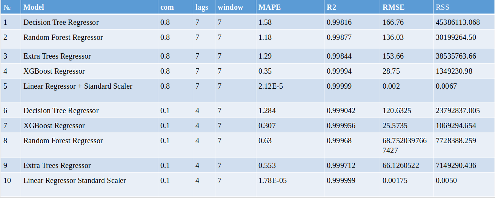
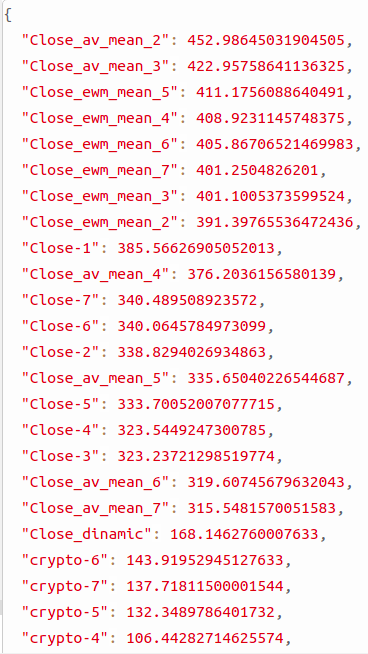

# Bitcoin prediction for 1 day
Predict stock value of Bitcoin price. I used Yahoo API for gathering stock value and Google Trends API.

After gathering normalized values of searcing words with 85% of missing values. Used linear interpolation for filling missing values. Next step is to concatenated the Bitckoin time series price and other time series (amount of searching words “bircoin”, “BTC”, “bitcoin exhange”, “cryptocurrency” etc.)

Saved trained models, lags count, features importances, image with prediction on train and test in MLFlow. Too saved statisctics for residual like mean, std, autocorrelation, partial autocorrelation, QQ-plot and PDF for train and test set.

**Feature engeneering**: got from each time series lags, moving average, exponential moving average, moving standart deviation, exponential standart deviation. Prepared data like regression task.  
**Research**: Compared result using Box-Cox transformation and not. Using 180 and 30 days for test set and comparing metrics. Worked with not stationar time series. 
**Libraries**: scikit-learn, Pandas, Numpy, Featuretools, SciPy, Matplotlib, Pandas-Profiling, yahoofinance, pytrends, statsmodels, MLFlow. 
**Models** : RandomForest, XGBoost, LinearRegression, Extra Trees, Decision Tree, Elastic Net. 

## Files:
- Classes for feaures engeenering. You can see .py file [here.](https://github.com/bateikoEd/dipl_program/blob/main/bitcoin%20predicton/feature_engeeniring.py)
- Class for combining gathered data from APIes. You can see .py file [here.](https://github.com/bateikoEd/dipl_program/blob/main/bitcoin%20predicton/pipeline_gatehering.py)
- Additional fucntions for creating images, metrics and saving in MLFlow. You can see .py file [here.](https://github.com/bateikoEd/dipl_program/blob/main/bitcoin%20predicton/functions.py)
- Notebook for full process of gatehering, preparing data and tuning models. You can see [here.](https://nbviewer.jupyter.org/github/bateikoEd/dipl_program/blob/main/bitcoin%20predicton/data_gathering_preparation.ipynb)
- In notebook we can see all time series before and after Box-Cox transforming. Too can see statistics for each time series and corelation matrix using pandas-profiling. You can see [here.](https://nbviewer.jupyter.org/github/bateikoEd/dipl_program/blob/main/bitcoin%20predicton/template_data.ipynb)

## Some insights
On this curves we can see all amount of google requests of word which were gathered from Google Trends.

Bitcoin time series. Using PACF the most important lag is 1 (previous day).

Bitcoin time series after Box-Cox transformation.

Statistics for Bitcoin time series.

Pearson correlation matrix for words time series.
All words have strong linear dependencies for each other.

Spearman correlation matrix for words time series.
All words have strong not linear dependencies for each other.

## Feature importances for models which use Close as a feature
Feature importances for Extra Trees.
Usnig Box-Cox, feature importances do not radical changed. 
The most important features are “crypto”. But using Close as a feature we have the most important feature is Close.

Feature importances for Linear Regressinon.
The most important features are “bitcoin price”, “cryptocurrency bitcoin”, “buy cryptocurrency”, “Bitcoin Cash”, “cryptocurrency”, “what is cryptocurrency”

## Feature importances for models which do not use Close as a feature

Feature importances for Decision Tree.
The most important features are  number of year, number of month, number of week, “crypo”, “buy bitcoin” and “bitcoin price”.

Feature importances for ExtraTrees.
The most important features are  number of year, number of month, number of week,  “bitcoin kurs” and  “crypto”.

Feature importances for LightGBM.
The most important features are “binance”, “crypto”, number of year, “cryptocurrency”, “bitcoin curs” and ”buy bitcoin”.

Feature importances for Random Forest.
The most important features are number of week, “crypto”, “binance” and “Bitcoin Gold”.

Feature importances for XGBoost.
The most important features are number of year, “bitcoin kurs”, “buy bitcoin”, “binance” and “crypto”.

Feature importances for Linear Regression.
The most important features are “buy cryptocurrency”, “buy bitcoin”, “cryptocurrency market”, “news cryptocurrency”, “what is cryptocurrencies”, “Bitcoin Gold”, “best cryptocurrency”.

## Models metrics using 30 days test set using Close as a feature

Metrics using train set.

Metrics using test set.

## Models metrics using 30 days test set without using Close as a feature

Metrics using train set.

Metrics using test set.

## Models metrics using 180 days test set without using Box-Cox 
Using Close as feture.

Metrics using train set.

Metrics using test set.

## Models metrics using 180 days test set using Box-Cox 
Using Close as feture.

Metrics using train set.

Metrics using test set.

## Example for Elastic Net model 

Metrics for model.

Prediction plot on train and test set.

Featrues importance plot.

Featrues importance values.

PDF residuals on train(left) and test(right) set.

Residulas time series for train set.

Residulas time series for test set.

Numerical statics for residuals on train and test sets.

## Conclusion
- The most important words are “crypto”, “best cryptocurrency”, “cryptocurrency bitcoin”, “cryptocurrency”. 
- Changing test set from 180 to 30 day caused good results because last 180 day have other tendency and distribution than train dataset.
- Box-Cox transformation do not have real impact on models for this time series.
